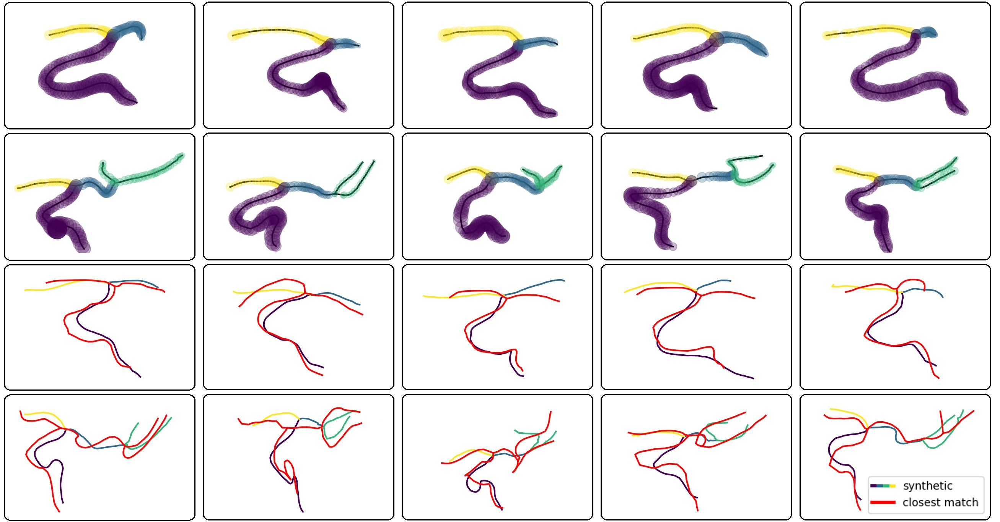

# Vessel Diffusion

---

### Code

The model and diffusion code is provided in `modules/edm.py`. The centerline sequencing algorithm is provided in `centerline_sequencing/centerline_sequencing.py`. Example training and sampling code is provided in `train.py` and `sampling.py`.

---

### Citation

todo

---

### Acknowledgments

Our diffusion code is modified from https://github.com/NVlabs/edm.

